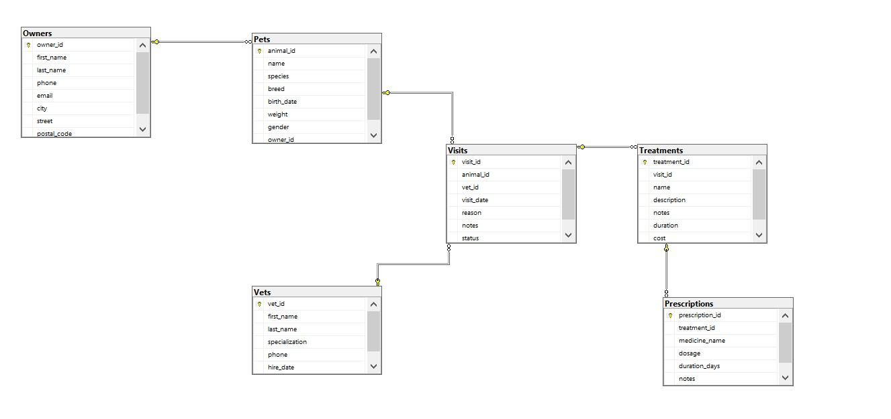
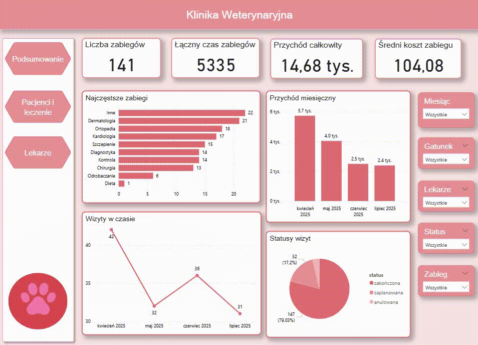
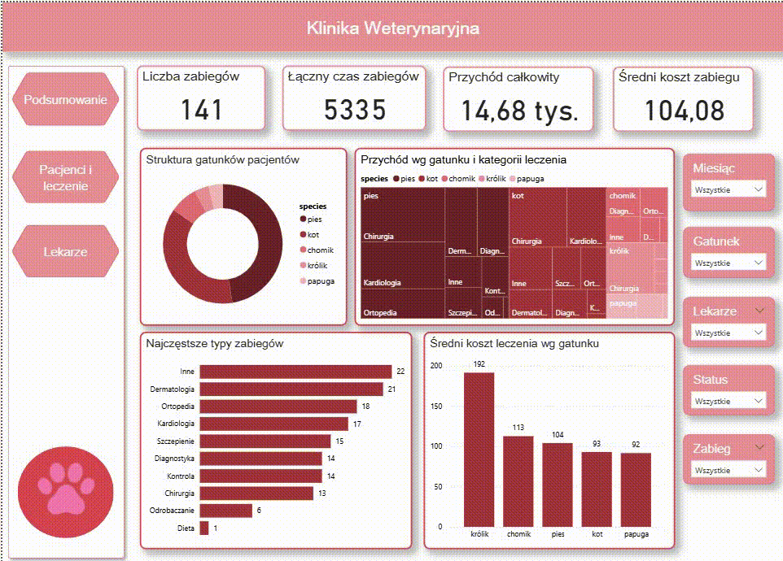
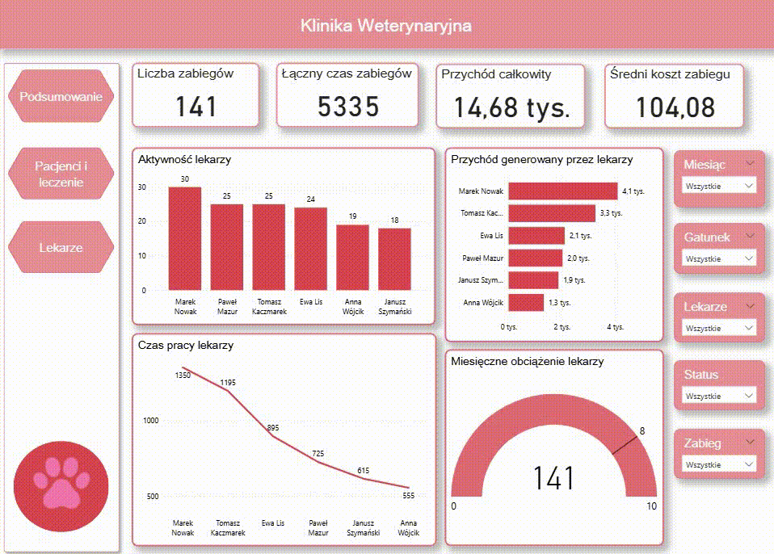
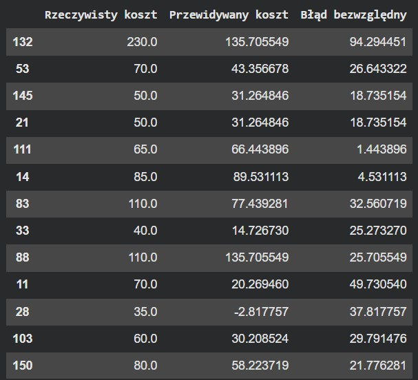
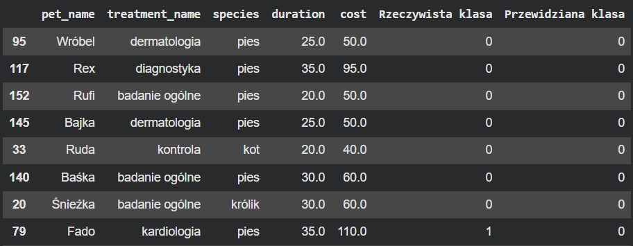

# Veterinary-Clinic-data-analysis-and-machine-learning
This project presents a complete data analytics workflow for a veterinary clinic. The solution covers database design, data analysis, dashboard creation, and machine learning models used to predict treatment costs and classify expensive procedures.

The project was developed using SQL Server, Excel, Power BI, and Python.

# SQL Database
The database was designed and implemented in Microsoft SQL Server. The project includes a relational database structure consisting of multiple interconnected tables representing veterinary clinic operations, including patients, owners, visits, treatments, prescriptions, and veterinarians.
The database schema was created using primary and foreign keys to ensure data integrity and proper relationships between entities.

To support analytical and machine learning tasks, a larger dataset was generated using AI-assisted synthetic data generation in Claude AI, allowing for more realistic analyses and model training while preserving data consistency.

*Fig. 1. Entity relationship diagram of the veterinary clinic database.*

# Excel 
Microsoft Excel was used to perform business-oriented data analysis and reporting. The analysis was based on Pivot Tables, Pivot Charts, and calculated KPIs, providing insights into the veterinary clinic's operations.

The Excel dashboard included:
- revenue analysis by veterinarian
- average treatment cost by animal species
- analysis of treatment categories
- patient activity statistics
- treatment frequency and visit counts

KPI
- Total number of treatments
- Total number of patients
- Total revenue
- Average treatment cost
- Most expensive and cheapest treatment
- Number of cancelled visits

Pivot Tables and charts were used to identify trends, compare veterinarian performance, analyze treatment profitability, and explore patient-related statistics. The Excel analysis served as the foundation for further reporting in Power BI. 

# Power BI Dashboard
An interactive Power BI dashboard was developed to visualize key operational and financial metrics of the veterinary clinic. The dashboard enables users to explore clinic performance through multiple analytical perspectives and dynamic filtering.

Dashboard Sections
1. Summary

The summary page presents the most important KPIs and provides a high-level overview of clinic operations, including:
- total revenue
- number of treatments
- average treatment cost
- cancelled visits
- general business performance indicators

*Fig. 2. Power BI dashboard presenting key clinic performance indicators.*
2. Patients and Treatments

This section focuses on patient activity and treatment analysis:
- treatment distribution by category
- average and total treatment costs
- analysis by animal species
- most active patients

*Fig. 3. Dashboard showing patient analysis and treatment types.*
3. Veterinarians

This section evaluates veterinarian performance through:
- number of visits handled
- total revenue generated
- average treatment cost
- comparison of veterinarian activity and productivity

*Fig. 4. Dashboard showing veterinarian analysis.*

The dashboard supports interactive exploration of data and provides valuable insights into clinic operations, patient care, and financial performance.

# Python Analysis and Machine Learning
Python was used for exploratory data analysis, data visualization, statistical analysis, and machine learning. Data from multiple SQL tables were merged into a single analytical dataset to enable comprehensive analysis of clinic operations.

The analysis included:
- descriptive statistics
- treatment and visit analysis
- patient and species statistics
- revenue analysis
- cancelled visit analysis
- treatment duration analysis
- correlation analysis between treatment duration and cost

Several visualizations were created using Matplotlib to identify trends and relationships within the data.

Machine Learning

Two machine learning tasks were implemented:
1. Regression

The objective was to predict treatment cost based on selected treatment and patient characteristics.

Models tested:
- Linear Regression
- Random Forest Regressor
- XGBoost Regressor

Evaluation metrics: R^2 Score, Mean Absolute Error 

*Fig. 5. Comparison of actual and predicted treatment costs.*

2. Classification

The objective was to predict whether a treatment would be classified as expensive (cost > 100).

Models tested:
- Logistic Regression
- Random Forest Classifier

Evaluation metrics: accuracy, precision, recall, F1 Score, ROC-AUC

*Fig. 6. Comparison of actual and predicted classifications for cheap and expensive treatments*

Additional experiments included:
- hyperparameter tuning using GridSearchCV
- class imbalance handling with SMOTE
- feature importance analysis
- prediction for new unseen records

The machine learning workflow demonstrated the complete process of data preparation, model training, evaluation, optimization, and interpretation of results.

# Project summary
This project demonstrates a complete end-to-end data analytics workflow for a veterinary clinic, starting from relational database design and SQL data management, through business analysis in Excel and Power BI, to advanced data analysis and machine learning in Python.

